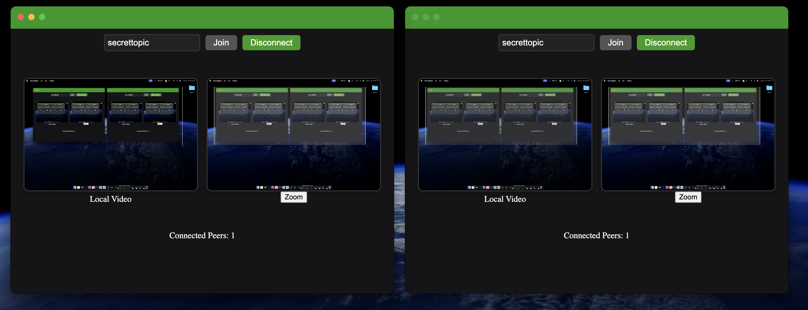

# Evaluating Screen Sharing Application using Pear Runtime

First attempt to have a P2P screen sharing using Pear Runtime.



## Features

- **Real-Time Screen Sharing**: Share your screen (+audio) with minimal latency.
- **Peer-to-Peer Connections**: Direct connections without central servers.
- **Cross-Platform**: Compatible with Windows, macOS, and Linux.

## Installation

### Prerequisites

- [Node.js](https://nodejs.org/) (v14 or higher)
- [Pear Runtime](https://docs.pears.com/guides/getting-started)
- [Git](https://git-scm.com/)

1. **Install Pear (once)**

   ```bash
   npm i -g pear
2. **Finalize install (once)**

   ```bash
    pear run --no-ask pear://runtime
### Steps

1. **Clone the Repository**

   ```bash
   git clone https://github.com/fdarie/pear_video.git
2. **Navigate to the Project Directory**

   ```bash
   cd pear_video
3. **Install dependencies**

   ```bash
   npm install
4. **Change the topic name**

   ```bash
   https://github.com/fdarie/pear_video/blob/main/streaming.js#L127
5. **Run two or more instances of the app (local)**

   ```bash
   pear run --no-ask --tmp-store .